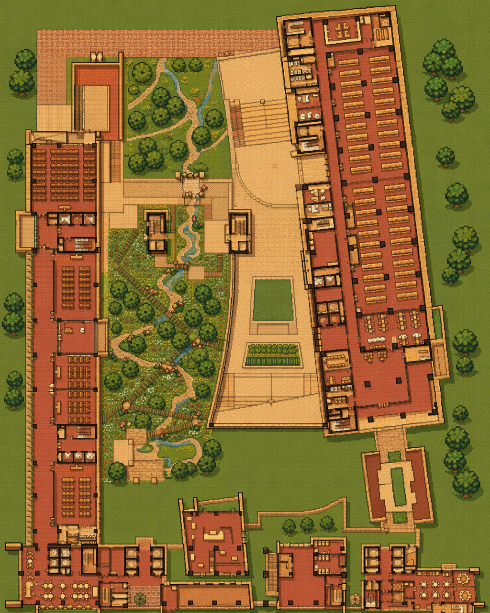

# SIGSAgent

> 一个**校园多智能体仿真**项目。
> 60+ 位 NPC 在 16 个房间组成的校园拓扑里依各自的人设与课表生活、移动、对话；
> 每条决策都对接真实 LLM（DeepSeek，OpenAI-compatible）。支持在画布上**绘制碰撞/场景范围**、
> NPC **A\* 寻路**绕障，记录**移动 / 驻留 / 格子轨迹**三类热力，并自动产出
> **每日上帝视角旁白**与**每周逐人空间体验评价**。整局数据可一键**保存 / 续跑**。



```
┌─────────────────────────┐   REST /api/*        ┌──────────────────────────────┐
│  Frontend (Vue 3+Vite)  │ ───────────────────▶ │  Backend  (FastAPI + asyncio) │
│                         │ ◀──── WS /ws  ────── │                              │
└─────────────────────────┘                       └──────────────────────────────┘
        │                                                │
        ▼                                                ▼
  Relations / Scene / Memory /                  SimLoop (5 min tick)
  Agent Detail / Timeline / Heatmap            perceive → decide → act
  + 绘制碰撞/范围 · A* 寻路 · 回放                 → 每日旁白 / 每周空间评价（后台）
        │                                                │
        ▼                                                ▼
  Day/Week Summary Modal（弹窗，不暂停）          WorldState + SceneGraph + 占据网格
                                                  Memory: STM(30) / LTM(15) / Graph
                                                  LLM Adapter (real + mock fallback)
                                                  Recorder（逐帧）+ Export/Import
```

---

## 核心特性

### 仿真引擎
- **5 分钟粒度 tick**：`sim_tick_seconds=300`，单 tick 实际间隔可调（默认 1s 加速）。
- **WorldState 真源**：所有动作的 `effects` 写回 WorldState，所有 perception 从这里读。
- **并发 tick**：一个 tick 内 60+ agent 经信号量限流后用 `asyncio.gather` 并发决策，
  把 N 次串行 LLM 往返压成约 1 次（`SIM_TICK_CONCURRENCY` 可调，设 1 即严格串行）。
- **跨午夜不再暂停**：sim 跨过 00:00 时**后台**收集当天 dialog + behavior 喂给 LLM 生成
  中英双语小说式旁白，落 `sim.day_summaries`、广播 `day_summary`，前端弹出可被新弹窗覆盖的
  Modal —— **模拟继续推进，不再卡住等玩家点「下一天」**。
- **跨周空间评价**：sim 跨 ISO 周时**后台**为每个 agent 触发一次空间体验评价（见下）。

### Agent 架构
- **Perception**：`children(here) ∪ siblings(here)`，不穿透到孙节点。
- **Memory**
  - **STM**（30 槽，命中计数）
  - **LTM**（15 槽，命中计数；STM 溢出→LLM 压缩；LTM 不足 5 槽时先压缩末尾 3 条让位）
  - **Memory Graph**（三元组，供旁白与玩家叙事，决策不读）
  - 全部记忆**双语存储**（`text` / `text_en`），UI 一键切换语言。
- **Schedule**
  - 周课表式模板（每天不同），关键时段锚定，留大量空隙
  - 通用 fragments 由 LLM `choose_fragment` 在空隙处插值
  - 每个落地的 schedule item 即一条 STM
- **Decision = SlotFiller + GOAP**
  - SlotFiller：把当前 perception/memory/lastActivity 作为 context 喂 LLM
  - GOAP：基于 `actions.json` 的 preconditions/effects/cost A\* 求解；支持 `>=, <=` 等比较算子
- **Behavior**：9 个原子动作（`move / talk / interact / mutter / phone_call / find / idle /
  pickup / drop`），执行后将 `pre_state → post_state`、`ok`、`note` 一并写回 STM 与 WS。
- **双通道表现**：行为通道（移动/拾放/互动）与对话通道（talk/mutter/phone_call）并行，
  让 NPC 在“做事”的同时也能“说话/自语”。

### 空间编辑 · 碰撞 / 场景范围 / A\* 寻路
- **画笔绘制**：在 `/scene` 拓扑画布上用画笔/橡皮绘制
  - **碰撞区**（不可行走）：NPC 转场景时用 **A\*** 绕开；
  - **场景范围**（每个房间的格子足迹）：房间内 NPC 在足迹格子里**散布**而非绕节点排圈。
- **A\* 寻路**：基于占据网格的 8 向 A\*（octile 启发、禁切角、视线平滑），
  沿折线平滑滑行；无障碍时退化为直线。
- **点击选场景**：场景范围模式下，**点击画布上的场景节点**即可选中要绘制的房间（也可用下拉框）。
- **规则约束**：场景范围不能覆盖到碰撞格；绘制时画布平移/缩放暂停，画笔独占指针。
- **持久化**：碰撞与场景范围随布局（含拖动后的房间坐标）落 `runtime/scene_layout.json`，
  经 `GET/PUT /api/scene/layout` 读写。

### 热力图（三层 + 单 agent 轨迹）
- **移动热力**：无向边 `a|b` 的累计穿行次数。
- **驻留热力**：房间每 tick 的在场样本累计。
- **格子轨迹热力**：agent **每进入一个新格子** +1（同格停留不重复计数，避免“驻留无限叠加”），
  支持**一键清空重绘**，以及**指定单个 agent**只看其个人轨迹。
- 全局累计热力独立于前端 localStorage，随导出留存。

### 每日旁白 & 每周空间评价
- **每日旁白**（`day_summary`）：小说式中英双语段落（含主人公 / 配角 / 情节 / 明日预测）。
  现为**非阻塞弹窗**，新旁白覆盖旧弹窗；亦可点「✍ 立即总结」手动触发（不暂停）。
- **每周空间评价**（`week_summary`）：每个 agent **结合自身人格(OCEAN)/偏好/档案 +
  本周记忆/对话/常去地点**，以第一人称评价当前建筑空间，并给出**想要的新功能**与
  **体验不好的地方**。可点「🏛 每周总结」手动触发，或跨周自动产出；弹窗内可按关键词检索。

### 回放 & 录制
- 后端 Recorder 逐帧记录，`GET /api/recordings[/{name}]` 拉取。
- 前端回放采用**结算式调度**：等当前帧动画真正播完（`animBusy` 归零）再进下一帧，
  配合**稳定的 NPC 排布**（散布用哈希、排圈用全局固定序号，与同房间其他人无关），
  消除换帧重绘导致的跳帧 / 抖动。

### 存档 · 续跑 · 关停
- **全量导出**（`POST /api/export`）：记忆/行为/世界/累计热力/关系/旁白一并落 JSON，
  服务器留存且浏览器下载。
- **导入续跑**（`POST /api/import` 或 `/import/by-name/{name}`）：恢复后保持暂停，可“接着跑”。
- **优雅关停**（`POST /api/service/shutdown`）：先自动保存再停止后端进程。

### LLM 容错
所有 LLM 调用先打真实 API（DeepSeek），失败回退到 `MockLLMAdapter`，
并把 `degraded=True` 一路传播到产物上（旁白 / 空间评价同样有降级占位）。

### 前端可视化（Vue 3 + vis-network + Pinia）
| 路由 | 内容 |
|---|---|
| `/relations` | 60 NPC 社交关系图 + 多标签侧栏（NPC/Edge/Scenes/Timeline/Heat），**NPC 详情卡完整双语**（人格底色 / 双层人格 / 动态层 / 生活方式） |
| `/scene` | 16 房间六边形拓扑 + 实时 NPC 追踪动画 + 物品搬运 + **A\* 寻路绕障** + **碰撞/场景范围画笔** + **移动/驻留/格子轨迹三层热力** + 节点点击查看三元组事件 + 缩放自适应节点尺寸 + 房间/NPC/物品尺寸 & 连线长度调节面板 + **录制回放** |
| `/agent/:id` | 单 NPC 的 STM/LTM/Schedule/Behavior/Perception |
| `/memory-graph` | NPC-中心三元组叙事图：节点 = NPC，边 = NPC↔NPC 互动（按 pair 聚合）；**互动热力**（边粗细/颜色随互动次数渐变、活跃 NPC 橙色光晕、最热对金色发光）+ **边色图例** + 可调 top-K 标签 |
| `/timeline` | 实时 WS 事件流 + 种子叙事轴 |

顶部条始终展示 **⏱ 当前 sim 时间 / Pause / Resume / Step / ✍ 立即总结 / 📜 旁白 /
🏛 每周总结 / 🗂 周评 / 保存 / 导入 / 终止服务**；每日旁白与每周评价以**弹窗**呈现且不暂停。中/EN 一键互换。

---

## 目录结构

```
SIGSAgent/
├── backend/                FastAPI 服务（uvicorn app.main:app）
│   └── app/
│       ├── api/            REST + WebSocket 入口
│       ├── sim/            5min tick 主循环 + 每日旁白 / 每周空间评价触发器 + Recorder
│       ├── agents/         NPCAgent + memory/schedule/decision/behavior/perception
│       ├── world/          SceneGraph + WorldState
│       ├── llm/            OpenAI-compatible client + prompts/*.j2 + 旁白/空间评价 builder
│       ├── config/         pydantic 校验 + data/ 加载
│       ├── events/         内部事件总线 → WS 广播
│       └── persistence/    aiosqlite + 导出 / 导入
├── frontend/               Vue 3 + Vite 前端
│   └── src/
│       ├── views/          路由级页面
│       ├── components/     可复用面板（DaySummaryModal / WeekSummaryModal / …）
│       ├── stores/         Pinia stores（lang / events / world / sim / agents / heat / playback / …）
│       ├── api/            REST 端点 + WS 客户端
│       └── pathfinding.ts  网格 A\* 寻路 + 折线平滑 / 采样工具
├── data/                   共享只读剧本（场景 / 60 personas / 60 schedule_templates / actions / fragments）
├── runtime/                运行时产物（SQLite / 快照 / scene_layout.json），可随时清空“重开一局”
├── docs/                   架构 / 模块 / 数据契约 / LLM 兜底 / UX spec
├── scripts/                启动 / 重置 / 重生成 / e2e 烟雾测试
├── .env.example            环境变量模板
└── guoyi_rooms_v2.json     原始场景拓扑（已被 scenes/ 消费）
```

---

## 快速开始

### 0. 准备 Python ≥ 3.11 与 Node.js ≥ 18

### 1. 配置环境变量

```powershell
Copy-Item .env.example .env
# 编辑 .env，填入你的 DeepSeek key（或任意 OpenAI-compatible endpoint）
```

`.env` 关键项：

| Key | 默认 | 说明 |
|---|---|---|
| `LLM_BASE_URL` | `https://api.deepseek.com/v1` | OpenAI-兼容 endpoint |
| `LLM_API_KEY` | — | 填你的 key（也可在前端入口页填写） |
| `LLM_MODEL` | `deepseek-chat` | |
| `SIM_TICK_SECONDS` | `300` | sim-world 一个 tick 多少秒 |
| `SIM_REAL_TICK_SECONDS` | `1` | 真实世界两个 tick 间隔（越小越快） |
| `SIM_TICK_CONCURRENCY` | — | 一个 tick 内并发跑 agent 的上限（设 1 即严格串行） |
| `SIM_AUTOSTART` | `false` | 后端启动后是否自动开始 tick |
| `SIM_START_TIME` | `2026-05-26T07:00:00` | sim 起始时间；改成 `…T23:55:00` 可立刻验证跨午夜 |

### 2. 一键拉起

**Windows 双击启动**（推荐）：

```
start.bat
```

会弹出两个独立 cmd 窗口分别跑 backend（:8000）与 frontend（:5680），并在 ~7s 后
自动打开浏览器到 `http://127.0.0.1:5680/`。控制台用 UTF-8（`chcp 65001`），中文不会乱码。

**PowerShell 替代**：

```powershell
.\scripts\run_dev.ps1
```

或手动启动：

```powershell
# 后端
cd backend
python -m venv .venv
.venv\Scripts\Activate.ps1
pip install -e .[dev]
uvicorn app.main:app --reload

# 前端
cd ..\frontend
npm install
npm run dev
```

打开 **http://127.0.0.1:5680/** 即可。
API 文档在 **http://127.0.0.1:8000/docs**。

### 3. 想立刻看跨日旁白？

```powershell
$env:SIM_START_TIME = "2026-05-26T23:55:00"
uvicorn app.main:app --reload
```

第一个 tick 就会跨日，后台生成旁白并弹出 Modal（**不再暂停**，模拟继续推进）。

---

## 关键 API

### REST（前缀 `/api`）

| Method | Path | Purpose |
|---|---|---|
| GET | `/health` | 存活探针 |
| GET | `/scene/graph` | 场景拓扑（vis-network 格式） |
| GET / PUT | `/scene/layout` | 读写布局：房间坐标 / 视图设置 / **碰撞 obstacles / 场景范围 roomAreas** |
| GET | `/recordings` · `/recordings/{name}` | 回放帧列表 / 单条录制 |
| GET | `/world` | 实时 WorldState 快照 |
| GET | `/agents` · `/agents/{id}` | NPC 简表 / 单 NPC 完整 persona |
| GET | `/agents/{id}/memory` | STM / LTM / 三元组（均含 `text_en`） |
| GET | `/agents/{id}/schedule` · `/history` · `/perception` | 时间轴 / 已执行步骤 / 感知快照 |
| GET | `/relations` · `/scenes-library` · `/timeline-seed` | 关系边 / 剧本场景 / 种子叙事 |
| GET | `/config/personas` · `/config/actions` · `/config/fragments` | 只读配置 |
| POST | `/config/reload` | 热重载 `data/*` |
| POST | `/sim/start` · `/sim/pause` · `/sim/step` | 启动恢复 / 暂停 / 单步 |
| GET | `/sim/status` | `{running, sim_time, pause_reason, current_day}` |
| GET | `/sim/day_summaries` | 历史每日旁白（双语） |
| POST | `/sim/summarize_now` | 立刻总结当前日（不暂停） |
| **GET** | **`/sim/week_summaries`** | 历史每周空间评价 |
| **POST** | **`/sim/summarize_week_now`** | 立刻为本周生成逐人空间评价（不暂停） |
| GET | `/heatmap` | 全局累计移动/驻留热力 |
| GET | `/llm/status` · POST `/llm/key` | LLM 连通状态 / 运行时设置 key |
| POST | `/export` · GET `/exports[/{name}]` | 全量导出 / 列表 / 下载 |
| POST | `/import` · `/import/by-name/{name}` | 导入续跑 |
| POST | `/service/shutdown` | 自动保存后优雅关停后端 |

### WebSocket `/ws`

| `type` | 含义 |
|---|---|
| `welcome` | 握手 + 当前 WorldState 快照 |
| `tick` | 每个 tick 推一次，含 `world_delta.moved` 与 `recent_decisions` |
| `agent_decision` | 单 NPC 决定/执行动作时 |
| `behavior` | 动作执行结果（含 `pre_state` / `post_state`） |
| `dialog` | NPC 对话（中英双语 lines + topic + tone） |
| `mutter` | NPC 内心独白 / 自语 |
| `insert_event` | schedule 空隙处插入的临时事件 |
| `day_summary` | **每日旁白**：`{day, narrative_zh, narrative_en, story_*, tomorrow_*, stats, degraded}` |
| `week_summary` | **每周空间评价**：`{week, week_start, week_end, agents:[{name, evaluation_*, wants, pain_points, favorite_place, …}]}` |
| `agent_error` | 单 NPC tick 失败 |

---

## 数据契约速览

| 目录 | 内容 |
|---|---|
| `data/scenes/` | 场景拓扑图（房间 + adjacent 邻接） |
| `data/personas/` | 单 NPC 人格（性格 / 偏好 / 关系 / 初始位置 / profile） |
| `data/schedule_templates/` | 每个 NPC **每天不同**的周课表，每个 slot 含 `target_state` |
| `data/schedule_fragments/fragments.json` | 通用片段，duration 5–45 分钟 |
| `data/actions/actions.json` | 9 个 GOAP 动作（preconditions / effects / cost） |
| `data/relations.json` | NPC 关系边 |
| `data/scenes_library.json` | 剧本场景库 |
| `data/timeline_seed.json` | 种子叙事 |
| `data/memory_seed.json` | 每个 NPC 启动时预置的 STM/LTM/triplet |
| `runtime/scene_layout.json` | 运行时布局：房间坐标 / 视图 / **碰撞 / 场景范围**（前端读写） |

热改之后调 `POST /api/config/reload`，无需重启。

---

## 维护脚本

| 脚本 | 作用 |
|---|---|
| `scripts/init_data.py` | 把根目录的 `guoyi_rooms_v2.json` 迁入 `data/scenes/` |
| `scripts/seed_demo_npcs.py` | 生成最小可跑通的 demo NPC 集 |
| `scripts/regenerate_schedules.py` | **重新生成周课表**：稀疏锚点 + 凌晨睡眠守卫 + 留给 LLM 大量空隙 |
| `scripts/reset_runtime.ps1` | 清空 `runtime/`（SQLite + 快照）后“重开一局” |
| `scripts/e2e_llm_smoke.py` | 直接打 DeepSeek 跑通 `choose_fragment / summarize / triplet / dialog / narrate_day` |
| `scripts/e2e_llm_compression.py` | STM→LTM 压缩流程的端到端验证 |

---

## 测试

```powershell
cd backend
pytest -q
```

覆盖场景图、WorldState、STM/LTM、记忆图谱、schedule 时间轴、SlotFiller、GOAP planner、
behavior executor、感知、tick、LLM fallback 等。

前端类型检查：

```powershell
cd frontend
npx vue-tsc --noEmit
```

---

## 延伸阅读

- [docs/architecture.md](docs/architecture.md) — 一次 tick 的完整数据流
- [docs/modules.md](docs/modules.md) — 各 backend 模块责任边界
- [docs/data_schemas.md](docs/data_schemas.md) — JSON 契约逐字段说明
- [docs/llm_fallback.md](docs/llm_fallback.md) — LLM 容错协议
- [docs/reference_ux_spec.md](docs/reference_ux_spec.md) — 前端视觉规范（色板、热力 ramp、布局栅格）

---

## 路线图

- [x] `SimLoop._tick` 内多 agent 并发（`asyncio.gather` + 信号量）
- [x] 旁白支持手动触发与“本周回顾”（每周逐人空间评价）
- [x] 整局存档 / 导入续跑 / 优雅关停
- [x] 画布绘制碰撞 + 场景范围，NPC A\* 寻路绕障
- [ ] 把 `actions.json` 继续扩充，让 GOAP 搜索空间更丰富
- [ ] 给 Memory Graph 三元组的 `predicate` 也输出双语
- [ ] 把以内存为主的 STM/LTM/Graph 全量落 SQLite，进一步增强断点续跑

---

## 更新日志（近期高亮）

- **空间编辑 + A\* 寻路**：画布上用画笔绘制碰撞区与每个房间的场景范围；NPC 转场景时
  用 8 向 A\*（octile/禁切角/视线平滑）绕开障碍；房间内 NPC 在场景范围格子内稳定散布；
  场景范围可直接**点击场景节点**选择；布局（含碰撞/范围）持久化到 `scene_layout.json`。
- **格子轨迹热力图**：按“进入新格子”计数，避免驻留叠加；支持一键清空重绘与**单 agent** 轨迹查看。
- **每周空间评价**：每个 agent 结合人格 + 全量记忆 + 常去地点，第一人称评价空间、
  提出想要的新功能与体验痛点；`week_summary` 事件 + 弹窗 + REST 接口。
- **每日旁白改为非阻塞**：跨午夜不再暂停模拟，旁白以可被覆盖的弹窗呈现。
- **回放稳定性**：结算式换帧（等动画播完再进帧）+ 与同房间人数无关的稳定 NPC 排布，消除跳帧。
- **存档 / 续跑 / 关停**：全量导出 + 导入续跑 + 自动保存后优雅关停。
- **双通道行为 + 多跳导航 + 个性化活动**：行为与对话并行；跨多跳房间寻路；活动描述按人格定制。

---

## License

MIT。`data/` 里的中文人设与剧本为本项目原创，欢迎在保留署名前提下取用做研究/Demo。
